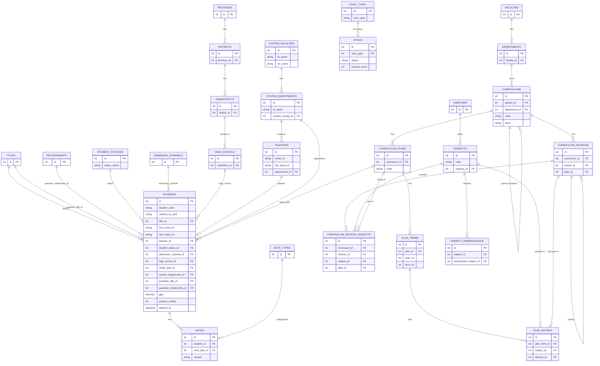

# Education API

REST API backend (Laravel 12) สำหรับ **ระบบฐานข้อมูลนิสิต** ใช้คู่กับ Frontend `education-web` (React) โปรเจกต์นี้ทำหน้าที่เป็นศูนย์กลางข้อมูลนิสิต หลักสูตร อาจารย์ที่ปรึกษา และเชื่อมต่อ/ประสานข้อมูลกับระบบภายนอกของมหาวิทยาลัย (ระบบบุคลากร, ระบบทะเบียน)

## Project Description

ระบบนี้เก็บและให้บริการข้อมูลของนิสิต (ประวัติ, สถานะการศึกษา, อาจารย์ที่ปรึกษา, แผนการเรียน/หลักสูตร) โดยมีจุดสำคัญคือ

- **ไม่ได้เป็นเจ้าของฐานข้อมูลหลักเพียงผู้เดียว** — ตาราง Eloquent ส่วนใหญ่ (`students`, `curriculums`, `teachers`, `system_departments`, ฯลฯ) ชี้ไปยังฐานข้อมูล MySQL ที่มีอยู่แล้ว (`education_dss`) ซึ่งอาจถูกสร้าง/ดูแลจากภายนอกโปรเจกต์ Laravel นี้ (ดูหัวข้อ [Database Setup](#database-setup))
- **Authentication เป็นแบบ JWT ที่ออกโดยระบบอื่น** (SSO/ระบบบุคลากรมหาวิทยาลัย) — API นี้แค่ตรวจสอบลายเซ็นของ token ที่ส่งเข้ามา ไม่มีหน้า login เป็นของตัวเอง
- **Sync ข้อมูลจากระบบภายนอก** — อาจารย์ (Teacher), คณะ/ภาควิชา (System Faculty/Department) จะถูกดึงจาก Personnel API ของมหาวิทยาลัยผ่าน endpoint `*/sync`
- **ข้อมูลผลการเรียน/การลงทะเบียน** (enrollments, เกรด, กราฟสรุปผล) ไม่ได้เก็บใน DB แต่อ่านจากไฟล์ JSON ที่วางไว้ใน storage ของแอป (ดูหัวข้อ [Usage](#usage))

## Features

### จัดการข้อมูลนิสิต (Students)
- ค้นหา/กรองรายชื่อนิสิตตามอาจารย์ที่ปรึกษา, ภาควิชา, คณะ, สถานะการศึกษา, ชื่อ, หรือข้อความในบันทึก (`GET /api/students`)
- ดูรายชื่อ "นิสิตที่กำลังศึกษาอยู่" ของอาจารย์คนหนึ่ง (`GET /api/students/studying`)
- ดูรายชื่อ "นิสิตที่ยังไม่มีอาจารย์ที่ปรึกษา" แยกตามภาควิชา (`GET /api/students/studying/without-advisor`)
- มอบหมาย/ถอดอาจารย์ที่ปรึกษาให้นิสิตหลายคนพร้อมกันแบบ transaction ป้องกันการชนกันของอาจารย์ (`PATCH /api/students/advisor`)
- เพิ่ม/แก้ไข/ลบ (soft delete) ข้อมูลนิสิตรายคน พร้อมคำนวณชั้นปี/ภาคการศึกษาปัจจุบัน และ resolve ภาควิชาของนิสิตให้อัตโนมัติจากอาจารย์ที่ปรึกษาหรือแผนการเรียน (`App\Actions\Students\SaveStudent`, `StudentDepartmentResolver`, `AcademicStandingCalculator`)
- บันทึกช่วยจำ (Notes) แนบกับนิสิตแต่ละคน พร้อมประเภทบันทึก (`/api/notes`)

### ข้อมูลผลการเรียน/การลงทะเบียน (จากไฟล์ JSON)
- ดึงข้อมูลการลงทะเบียนเรียนของนิสิตรายคน (`/api/students/{studentCode}/enrollments`)
- ดึงสถานะรายวิชา: ผ่าน/ไม่ผ่าน/เกินแผน (`/api/students/{studentCode}/enrollment-statuses`)
- ดึงข้อมูลสรุปผลการเรียนสำหรับทำกราฟ/แดชบอร์ด แยกตามหน่วยกิต, กลุ่มวิชา, ภาคการศึกษา (`/api/students/{studentCode}/performance-summary`)

### อาจารย์ / โครงสร้างองค์กร
- รายชื่ออาจารย์ พร้อม sync จาก Personnel API ของมหาวิทยาลัย (`/api/teachers`, `/api/teachers/sync`)
- คณะ/ภาควิชา (ระบบ) พร้อม sync จาก Personnel API (`/api/system-faculties`, `/api/system-departments` และ `*/sync`)

### ข้อมูลอ้างอิง (Master/Reference data)
คำนำหน้าชื่อ, ช่องทางการรับเข้า, โรงเรียนเดิม, ความสัมพันธ์ผู้ปกครอง, สถานะการศึกษา, ประเภทบันทึก, แผนการเรียน, หมวดหมู่ในหลักสูตร ฯลฯ — เป็น endpoint แบบ read-only (`GET /api/titles`, `/api/admission-channels`, `/api/high-schools`, `/api/relationships`, `/api/student-statuses`, `/api/note-types`, `/api/study-plans`, `/api/curriculum-divisions`)

### Sync log
- ดูประวัติ/สถานะการ sync ล่าสุดของแต่ละประเภท (`GET /api/syncs`)

### โมเดลหลักสูตรที่มีอยู่แต่ยังไม่เปิดเป็น API (พร้อมต่อยอด)
มี Model/Controller สำหรับ `Curriculum`, `CurriculumDivisionSubject`, `PlanEntry`, `PlanTerm`, `Subject`, `SubjectPrerequisite`, `Campus`, `Faculty`, `Department`, `Province`, `District`, `Subdistrict` อยู่แล้ว แต่ **ยังไม่ถูกลงทะเบียนใน `routes/api.php`** — เหมาะสำหรับต่อยอดฟีเจอร์ Dashboard/หลักสูตรในอนาคต

## Technologies

| ประเภท | เทคโนโลยี |
|---|---|
| Backend Framework | Laravel 12 (PHP ^8.2) |
| Database | MySQL (เชื่อมต่อฐานข้อมูล `education_dss` ที่มีอยู่แล้ว) |
| Authentication | Custom JWT middleware (`App\Http\Middleware\AuthenticateJwt` + `App\Services\JwtVerifier`, รองรับ HS256/384/512) — token ออกโดยระบบภายนอก |
| ORM | Eloquent |
| Frontend build (asset ของ Laravel เอง) | Vite 7, TailwindCSS 4 |
| API Documentation | [Scribe](https://scribe.knuckles.wtf/) — มี OpenAPI spec/Postman collection ที่ generate ไว้แล้วที่ `storage/app/private/scribe/` |
| Testing | PHPUnit 11 |
| Code style | Laravel Pint |
| External integration | Personnel API ของมหาวิทยาลัย (HTTP client ผ่าน `App\Services\PersonnelApiService`) |

> หมายเหตุ: โปรเจกต์ยังมี `laravel/sanctum` ติดตั้งอยู่ (มาจาก Laravel skeleton เริ่มต้น) แต่ API ปัจจุบัน**ไม่ได้ใช้ Sanctum ในการยืนยันตัวตน** — ใช้ JWT middleware ที่เขียนเองแทนทั้งหมด

## Requirements

- PHP >= 8.2 พร้อม extension ที่ Laravel 12 ต้องการ (pdo_mysql, mbstring, openssl, tokenizer, xml, ctype, json, bcmath)
- Composer 2.x
- Node.js + npm (สำหรับ build asset ของ Laravel เอง เช่นหน้า welcome/Vite)
- MySQL 8.x / MariaDB ที่เข้าถึงฐานข้อมูล `education_dss` ได้ (ต้องขอไฟล์ dump หรือสิทธิ์เข้าถึงจากทีม)
- ไฟล์ `.env` ที่มีค่าเชื่อมต่อจริง (ฐานข้อมูล, `JWT_SECRET`, `PERSONNEL_API_URL`) — ขอจากทีม/หัวหน้างาน

## Installation

เปิด/ปิด MySQL

# เปิด (รันเป็น background service, จะ auto-start ตอนเปิดเครื่องด้วย)
brew services start mysql

# ปิด
brew services stop mysql

# รีสตาร์ท (เวลาแก้ config หรือ import dump แล้วอยากรีเฟรช)
brew services restart mysql

# เช็คว่ากำลังรันอยู่ไหม
brew services list

```bash
# 1. Clone และเข้าโฟลเดอร์โปรเจกต์
git clone <repo-url> education-api
cd education-api

# 2. ติดตั้ง PHP dependencies
composer install

# 3. เตรียมไฟล์ .env
cp .env.example .env
# นำไฟล์ .env ที่ทีมแนบมาให้มาแทนที่ (มีค่า DB_*, JWT_SECRET, PERSONNEL_API_URL จริง)
php artisan key:generate   # ข้ามได้ถ้าใช้ .env ที่มี APP_KEY อยู่แล้ว

# 4. ติดตั้ง frontend asset ของ Laravel เอง (Vite/Tailwind)
npm install

# 5. รัน migration (สร้างเฉพาะตารางระบบของ Laravel เช่น users, cache, jobs, personal_access_tokens)
php artisan migrate

# 6. รันเซิร์ฟเวอร์ (server + queue + log + vite พร้อมกัน)
composer run dev
# หรือรันแยกเอง
php artisan serve
```

API จะพร้อมใช้งานที่ `http://localhost:8000/api` (หรือ URL ตาม `APP_URL`/`php artisan serve`)

## Docker Compose

`docker-compose.yml` ตั้งค่า default ให้เหมาะกับ local development เพื่อให้รัน `docker compose up --build` ได้ทันที:

```env
APP_URL=http://localhost:8000
FRONTEND_URL=http://localhost:5173
VITE_API_URL=http://localhost:8000/api
```

เมื่อต้อง deploy บน server ให้ใช้ไฟล์ env production แทน default ของ compose:

```bash
cp .env.production.example .env.production
# ใส่ APP_KEY, JWT_SECRET, DB_PASSWORD และค่า production อื่น ๆ ให้ครบ
docker compose --env-file .env.production up -d --build
```

ค่าที่ต้องเป็น URL จริงบน server:

```env
APP_ENV=production
APP_DEBUG=false
APP_URL=https://office.eng.kps.ku.ac.th/kukps-eng-education-ssd-api
FRONTEND_URL=https://office.eng.kps.ku.ac.th/kukps-eng-education-ssd
VITE_API_URL=https://office.eng.kps.ku.ac.th/kukps-eng-education-ssd-api/api
```

สรุปคือ `FRONTEND_URL` ใช้ฝั่ง backend สำหรับ CORS/mock-login redirect ส่วน `VITE_API_URL` ถูกฝังตอน build frontend; เวลาเปลี่ยนจาก local เป็น server ต้องเปลี่ยนทั้งสองค่าและ rebuild frontend container ใหม่

## Database Setup

**ข้อควรระวัง:** โฟลเดอร์ `database/migrations` ของโปรเจกต์นี้มีแค่ตารางพื้นฐานของ Laravel (`users`, `cache`, `jobs`, `personal_access_tokens`) เท่านั้น **ไม่มี migration ของตารางข้อมูลหลัก** เช่น `students`, `teachers`, `curriculums`, `system_departments` ฯลฯ

ตารางเหล่านี้ Eloquent Model อ้างอิงถึงโดยตรง (ผ่าน `$table`) และคาดว่ามีอยู่แล้วในฐานข้อมูล MySQL ชื่อ `education_dss` ซึ่งน่าจะถูกดูแล/สร้างขึ้นจากระบบอื่น (เช่นระบบทะเบียนของมหาวิทยาลัย) ดังนั้นขั้นตอนเตรียมฐานข้อมูลคือ

1. ขอไฟล์ dump ฐานข้อมูล `education_dss` (หรือสิทธิ์เข้าถึง MySQL instance ที่มีอยู่แล้ว) จากทีม
2. Import เข้าฐานข้อมูล MySQL ในเครื่อง แล้วตั้งค่า `DB_DATABASE=education_dss` ใน `.env` ให้ตรงกับชื่อฐานข้อมูลนั้น
3. รัน `php artisan migrate` เพื่อสร้างเฉพาะตารางระบบของ Laravel (auth/cache/queue/token) เพิ่มเติมเข้าไปในฐานข้อมูลเดียวกัน

ตารางหลักที่ระบบคาดหวังว่ามีอยู่แล้ว (ดูรายละเอียดคอลัมน์ใน [ER Diagram](#er-diagram)):

`students`, `titles`, `teachers`, `student_statuses`, `admission_channels`, `high_schools`, `relationships`, `notes`, `note_types`, `system_faculties`, `system_departments`, `faculties`, `departments`, `campuses`, `curriculums`, `curriculum_plans`, `curriculum_divisions`, `curriculum_division_subjects`, `plan_terms`, `plan_entries`, `subjects`, `subject_prerequisites`, `sync_types`, `syncs`, `provinces`, `districts`, `subdistricts`

> `App\Services\Students\StudentDepartmentResolver` ยังอ้างอิงตาราง optional ชื่อ `departments_map` (เช็คด้วย `Schema::hasTable` ก่อนใช้) สำหรับแมปรหัสภาควิชาแบบเก่า (`departments`) ไปยังภาควิชาระบบใหม่ (`system_departments`) — ถ้าไม่มีตารางนี้ ระบบจะ fallback ไปจับคู่ด้วยชื่อภาควิชาแทน

## Usage

### Authentication

API ทั้งหมด (ยกเว้น `/up` health check) ถูกครอบด้วย JWT middleware (`bootstrap/app.php` → `AuthenticateJwt` แปะเข้า group `api`) ต้องแนบ token แบบ Bearer ทุกครั้ง:

```
Authorization: Bearer <jwt-token>
```

- Token ต้องเซ็นด้วย secret เดียวกับ `JWT_SECRET` ใน `.env` (algorithm ตาม `JWT_ALGORITHM`, ค่าเริ่มต้น `HS256`)
- ต้องมี claim `exp` เสมอถ้า `JWT_REQUIRE_EXPIRATION=true`
- Claims ที่ระบบใช้งาน: `nontri_id`, `name`, `role`, `current_role`, `department_id`, `iat`, `exp`
- เรียก `GET /api/me` เพื่อตรวจสอบว่า token ถูกต้องและดูข้อมูลผู้ใช้ปัจจุบัน (ระบบจะพยายาม map `nontri_id` ไปหา record อาจารย์ในตาราง `teachers` เพื่อดึง `department_id`/`faculty_id` ที่ถูกต้องให้อัตโนมัติ)

ตัวอย่างการเรียก:

```bash
curl http://localhost:8000/api/me \
  -H "Authorization: Bearer <jwt-token>"

curl "http://localhost:8000/api/students?teacher_id=1" \
  -H "Authorization: Bearer <jwt-token>"
```

รูปแบบ Response มาตรฐาน (ดู `App\Helpers\ApiResponse`):

```json
{
  "success": true,
  "message": "OK",
  "data": { }
}
```

### ข้อมูลผลการเรียน (JSON files)

Endpoint กลุ่ม `/api/students/{studentCode}/enrollments|enrollment-statuses|performance-summary` อ่านไฟล์ JSON จาก local disk (`storage/app/private/`) โดยตรง ต้องวางไฟล์ตามโครงสร้าง:

```
storage/app/private/data/
├── enrollments/{studentCode}.json
├── enrollments_pass/{studentCode}.json
├── enrollments_not_pass/{studentCode}.json
├── enrollments_over/{studentCode}.json
└── graph/
    ├── by_credit/{studentCode}.json
    ├── by_semester/{studentCode}.json
    └── by_group/{studentCode}_1.json, _2.json, _3.json
```

ไฟล์เหล่านี้คาดว่าจะมาจากขั้นตอน sync เกรด (ดูงาน "ดูระบบ sync เกรด" ในแผนงาน) — ถ้าไม่มีไฟล์ endpoint จะตอบ 404 หรือระบุ `missing_sections`

### Sync ข้อมูลจากภายนอก

```bash
curl -X POST http://localhost:8000/api/teachers/sync -H "Authorization: Bearer <jwt-token>"
curl -X POST http://localhost:8000/api/system-departments/sync -H "Authorization: Bearer <jwt-token>"
curl -X POST http://localhost:8000/api/system-faculties/sync -H "Authorization: Bearer <jwt-token>"
```

ต้องตั้งค่า `PERSONNEL_API_URL` ใน `.env` ให้ชี้ไปยัง Personnel API ของมหาวิทยาลัย (base path ปัจจุบัน hardcode เป็น `/kukps-eng-personnel-api/api/portal-student-map` ใน `config/services.php`)

### API Documentation

มี OpenAPI spec และ Postman collection ที่ generate ไว้แล้ว (ผ่าน [Scribe](https://scribe.knuckles.wtf/)) ที่:
- `storage/app/private/scribe/openapi.yaml`
- `storage/app/private/scribe/collection.json`

### Testing

```bash
composer test
# หรือ
php artisan test
```

## Project Structure

```
app/
├── Actions/Students/          # Use-case ที่มี business logic ซับซ้อน (สร้าง/แก้ไขนิสิต, มอบหมายอาจารย์ที่ปรึกษา)
├── Helpers/ApiResponse.php    # รูปแบบ JSON response มาตรฐาน (success/error)
├── Http/
│   ├── Controllers/Api/       # Controller ของทุก endpoint (ผูก 1 controller ต่อ 1 resource)
│   ├── Middleware/            # AuthenticateJwt.php — ตรวจสอบ JWT ทุก request
│   ├── Requests/               # Form Request สำหรับ validate input (Student, Note)
│   └── Responses/             # API Resource สำหรับ format ข้อมูล output
├── Models/                    # Eloquent model ของทุกตาราง (ส่วนใหญ่ชี้ไปยัง DB ภายนอกที่มีอยู่แล้ว)
├── Providers/
└── Services/
    ├── JwtVerifier.php            # ตรวจลายเซ็น/claims ของ JWT
    ├── PersonnelApiService.php    # เรียก Personnel API ของมหาวิทยาลัย
    └── Students/                  # StudentQueryService (filter/search), StudentDepartmentResolver, AcademicStandingCalculator

routes/
├── api.php       # endpoint หลักทั้งหมด (ครอบด้วย JWT middleware)
├── web.php       # หน้า welcome เริ่มต้นของ Laravel เท่านั้น
└── console.php

database/
├── migrations/   # เฉพาะตารางระบบของ Laravel (users, cache, jobs, personal_access_tokens)
├── factories/
└── seeders/

config/
├── jwt.php       # การตั้งค่า JWT (secret, algorithm, issuer, audience, leeway)
└── services.php  # การตั้งค่า Personnel API

storage/app/private/
├── scribe/       # API doc ที่ generate ไว้ (openapi.yaml, collection.json)
└── data/         # ไฟล์ JSON ผลการเรียน/การลงทะเบียนของนิสิตแต่ละคน (ดู Usage)
```

## ER Diagram

แผนภาพนี้ครอบคลุมความสัมพันธ์หลักตามที่นิยามไว้ใน Eloquent Model (`app/Models/*.php`) ตารางทั้งหมดอยู่ในฐานข้อมูล `education_dss` ภายนอกโปรเจกต์ (ดู [Database Setup](#database-setup))



> หมายเหตุ: `FACULTIES`/`DEPARTMENTS` เป็นโครงสร้างองค์กร "ฝั่งหลักสูตร" (ใช้กับ `curriculums.department_id`) แยกจาก `SYSTEM_FACULTIES`/`SYSTEM_DEPARTMENTS` ซึ่งเป็นโครงสร้างองค์กรที่ sync มาจาก Personnel API และใช้ผูกกับ `students`/`teachers` โดยตรง — `StudentDepartmentResolver` เป็นตัวกลางที่แปลงรหัสภาควิชาฝั่งหลักสูตรให้ตรงกับภาควิชาฝั่งระบบ (ผ่านตาราง `departments_map` ถ้ามี หรือจับคู่ชื่อ)
